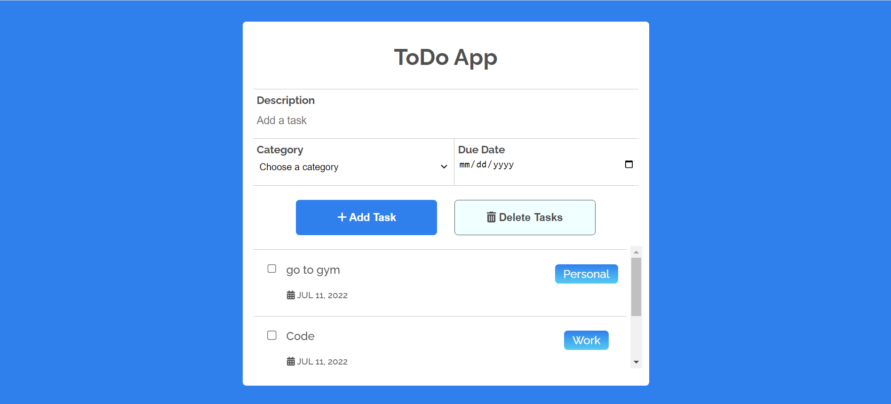

# ToDo-List

Check it out on -> https://polar-caverns-29584.herokuapp.com/

# ABOUT
This is a To Do List Project in which user can add any task of any category for a particular date. The data that user entered will be stored in a database which is hosted on MongoDB Atlas. The app itself is hosted on heroku.

# TECHSTACK
Node.Js, HTML, CSS, JavaScript, MongoDB

# APPROACH
I created a local server and used EJS view engine to set up the front end part of this application. I used Express.js to make the server and used Mongo DB to create the database.
